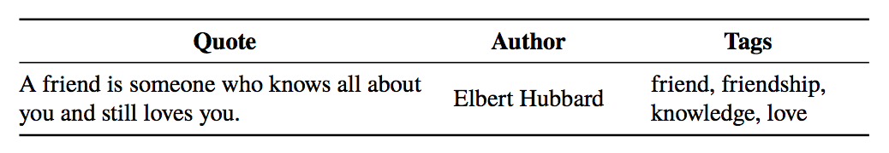

# Quotes-500K

Large Dataset on Quotes

Due to the unavailability of publicly available large dataset on Quotes, we prepared a dataset of our own for solving the task of proposing Contextually Relevant Quotes for images rather than just generating ordinary captions. 

For creating this dataset, we used the Python package - BeautifulSoup, to crawl quotes from various popular websites such as https://www.goodreads.com/quotes, https://www.brainyquote.com/ , http://www.famousquotesandauthors.com/ and http://www.curatedquotes.com/. All quotes, except the ones in English, were removed using the Python package - langdetect. 

The final dataset is offered in csv file format and contains three columns --- the quote, the author of the quote and the category tags for that quote. Examples of tags include --- love, life, philosophy, motivation, family etc. These tags help in describing the various categories that a particular quote belongs to. The total number of quotes in our final dataset after crawling and further cleaning of the dataset was approximately equal to five hundred thousand (500K) quotes. 

We have made this dataset publicly available, so that it can be used by fellow researchers for educational and research purposes. 

Link to Download Dataset: https://goo.gl/R3Sa34

<b>Please cite our paper if you wish to use this dataset for your research work.</b>

Title: Proposing Contextually Relevant Quotes for Images

Authors: Shivali Goel, Rishi Madhok, Shweta Garg

In proceedings of: 40th European Conference on Information Retreival

Year: 2018

